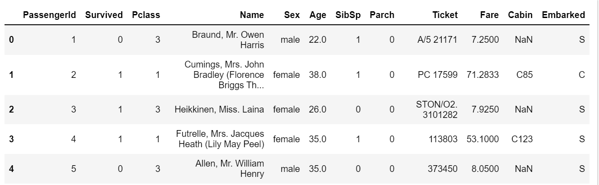
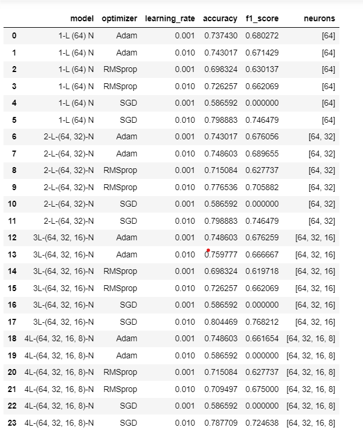
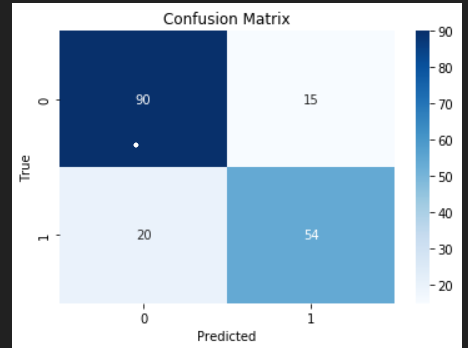

# Predicting the Survival of Titanic Passengers
The sinking of the Titanic is one of the most infamous shipwrecks in history.
On April 15, 1912, during her maiden voyage, the widely considered “unsinkable” RMS
Titanic sank after colliding with an iceberg. Unfortunately, there weren’t enough lifeboats
for everyone onboard, resulting in the death of 1502 out of 2224 passengers and crew.
While there was some element of luck involved in surviving, it seems some groups of
people were more likely to survive than others. Let's find out the factors which help to
survive.
The Titanic dataset contains information about the passengers on board the Titanic,
including their age, gender, and ticket class, among other features. In this project, we
used a Multi-Layer Perceptron (MLP) neural network to make predictions on this
dataset. We explored different configurations of MLPs with varying numbers of layers
and neurons per layer, as well as different optimizers and learning rates. Our goal was to
find the best model configuration that maximizes the accuracy of our predictions

-----
## Table of Contents
1. [Dataset Information](#dataset-information)
2. [Exploratory Data Analysis](#exploratory-data-analysis)
3. [Data Preparation](#data-preparation)
4. [Model Selection](#model-selection)
5. [Model Evaluation](#model-evaluation)
6. [Conclusion](#conclusion)
---
## Dataset Information:
The dataset contains 891 records in below format :

Here is a brief summary of the features included in the Titanic dataset:
- **PassengerId:** unique identifier for each passenger
- **Survived:** whether or not a passenger survived (0 = no, 1 = yes)
- **Pclass:** ticket class (1 = first class, 2 = second class, 3 = third class)
-  **Name:** name of passenger
-  **Sex:** gender of passenger
-  **Age:** age of passenger
-  **SibSp:** number of siblings/spouses aboard the Titanic
-  **Parch:** number of parents/children aboard the Titanic
-  **Ticket:** ticket number
- **Fare:** price of ticket
- **Cabin:** cabin number
- **Embarked:** port of embarkation (C = Cherbourg, Q = Queenstown, S =
Southampton)

---
## Exploratory Data Analysis
We conducted exploratory data analysis to gain insights into the dataset. We plotted
various charts to visualize the relationship between different features and survival
status. We observed that women had a higher chance of survival. Additionally,
passengers in higher ticket classes also had a higher chance of survival. Plots and their
interpretation can be found in the code file.

---
## Data Preparation
We started by loading the Titanic dataset into a pandas DataFrame and performing
some basic data cleaning and preprocessing steps. This included filling in missing
values, encoding categorical variables, and scaling numerical features.
We split the dataset into training and testing sets, with a 80/20 split, respectively.

---
## Model Selection
We explored four different configurations of MLP models, each with a varying number of
layers and neurons per layer. For each model configuration, we trained the model with
six different optimizers and learning rates.

---
## Model Evaluation
We evaluated the performance of each model by computing its accuracy score, f1
score, and confusion matrix on the testing set. We also computed the precision and
recall scores for each model configuration. Here is the Result:

### Confusion Matrix for best model:

---
## Conclusion
In conclusion, we successfully used an MLP neural network to predict survival on the
Titanic dataset. We explored different model configurations and optimizers and learning
rates, and found the best model configuration to be a 3-layer MLP with 64, 32, 16
neurons per layer wich optimized by SGD with learning rate 0.01. Our best model
achieved an accuracy of 81% on the testing set.
Further improvements to this project could include exploring more advanced machine
learning algorithms, such as ensemble methods or gradient boosting, and performing
more extensive hyperparameter tuning to further improve the accuracy of our
predictions.
